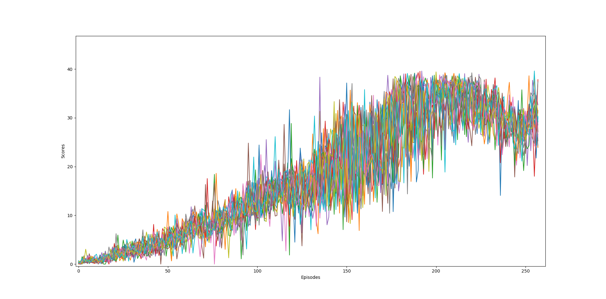
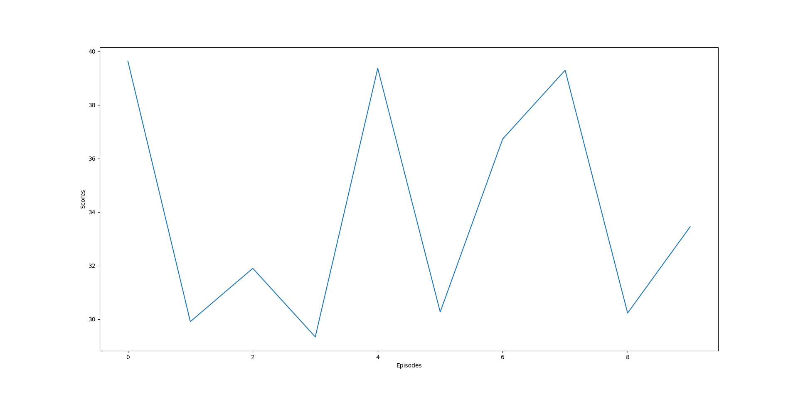

# Description of the Implementation

## Learning Algorithm

The learning algorithm used for this project uses an Actor-Critic network with a local and target network for both the Actor and Critic along with a replay buffer to store experience tuples. I used the algorithm from https://github.com/udacity/deep-reinforcement-learning/tree/master/ddpg-pendulum as a template and experimented on it using different hyperparameters for both actor and critic networks. The way the DDPG algorithm works is as follows:
- Say we have an environment with a state space and and a continuous actions space.
- The DDPG algorithm initializes four neural networks (two local networks and two target networks for the Actor and Critic).
- Since the DDPG is an off-policy algorithm, we will train on the local networks and "softly" update the target network every few timesteps based on a hyperparameter, tau.
The architecture of the networks can be described as follows:

- Input Layer: State size (which happens to be 33 in our case)
- First Hidden Layer: 256
- Second Hidden Layer: 128
- Output Layer: Action-Size (which in our case is 4 and is also continuous)

To train our agent, we use a replay buffer/replay memory to store the experiences that the agent has with the environment after every timestep. The replay memory has a size of 10^6 which means that we can store 10^6 experience tuples (state, action, reward, next_state, done) before it is full.

Once the replay memory has greater than 1024 experience tuples, at every 20th timestep, we sample a batch of 1024 tuples to train with. The agent then learns from these experiences and updates its weights for both the actor and the critic.

## Hyperparameters used

1. BUFFER_SIZE = int(1e6)  # replay buffer size
1. BATCH_SIZE = 1024       # minibatch size
1. GAMMA = 0.99            # discount factor
1. TAU = 1e-3              # for soft update of target parameters
1. LR_ACTOR = 3e-4         # learning rate of the actor
1. LR_CRITIC = 6e-4        # learning rate of the critic
1. WEIGHT_DECAY = 0        # L2 weight decay
1. LEARN_EVERY = 20        # learning timestep interval
1. LEARN_NUM = 10          # number of learning passes

## Plot of rewards for all agents

The project was solved on my PC that uses a GTX 1070 GPU. Training takes quite a long time so you have to be patient for it to solve the environment completely. Here's a plot of the scores of all 20 agents where the algorithm solved the episode in 158 episodes (It looks a little messy because all 20 agents' scores have been plotted in the same graph).

And here's a plot of the trained agent's score over 10 episodes:

Episode 1	Average Score: 39.64

Episode 2	Average Score: 34.77

Episode 3	Average Score: 33.82

Episode 4	Average Score: 32.70

Episode 5	Average Score: 34.03

Episode 6	Average Score: 33.40

Episode 7	Average Score: 33.88

Episode 8	Average Score: 34.56

Episode 9	Average Score: 34.08

Episode 10	Average Score: 34.01

## Future Ideas

1. PPO - Proximal Policy Optimization is a new class of RL algorithms which perform comparably or better than state-of-the-art approaches while being much simpler to implement and tune. PPO has become the default reinforcement learning algorithm at OpenAI because of its ease of use and good performance
1. D4PG - Distributed Distributional Deterministic Policy Gradients adopts distributional perspective on reinforcement learning and adapts it to the continuous control setting. We can combine this within a distributed framework for off-policy learning in order to develop D4PG. We can also combine this technique with a number of additional, simple improvements such as the use of N-step returns and prioritized experience replay.

